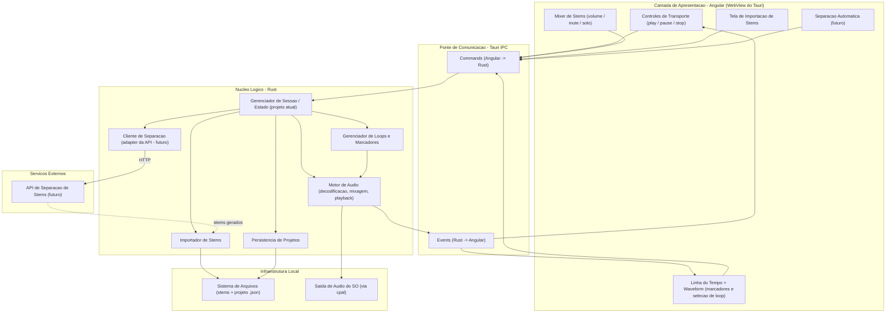

# Stem Player

Aplicativo desktop para reprodução de *stems* musicais com foco em **criar loops
de repetição de trechos por meio de marcadores temporais**.

## Sobre

Stem Player é uma ferramenta de estudo para **músicos iniciantes**. A partir dos
stems de uma música (faixas isoladas de cada instrumento), o usuário marca um
trecho na linha do tempo e o app o repete continuamente — permitindo praticar a
sua parte tocando junto, ou no lugar de, um instrumento da gravação original.

O usuário também controla o mixer de cada stem (volume, mute e solo), podendo,
por exemplo, silenciar o instrumento que está aprendendo e tocar por cima.

## Funcionalidade principal

**Loops de repetição por marcadores temporais.** Defina um marcador inicial e um
final em um trecho da música e repita-o quantas vezes precisar, no andamento da
gravação, com os demais instrumentos soando normalmente.

## Arquitetura

Toda a lógica fica em Rust; o Angular apenas desenha a interface.



## Stack

| Camada      | Tecnologia                          |
|-------------|-------------------------------------|
| Shell / IPC | Tauri 2                             |
| Interface   | Angular (somente apresentação)      |
| Lógica      | Rust — crate `stem-core`            |
| Áudio       | cpal (saída), symphonia (decodificação) |
| Persistência| serde / serde_json (projeto `.json`) |

## Estrutura do projeto

```
stem-player/
├── Cargo.toml          # workspace Cargo
├── crates/
│   └── stem-core/      # toda a lógica do app (alvo do TDD)
├── src-tauri/          # casca Tauri: expõe os commands
├── src/                # frontend Angular
├── openspec/           # specs e changes (fonte da verdade das features)
└── docs/               # documentação de visão e apoio
```

## Pré-requisitos

- **Rust** (toolchain estável) e Cargo
- **Node.js 22+** e npm
- **Dependências do Tauri no Linux** — `webkit2gtk-4.1` e afins

> O repositório inclui um `distrobox.ini` que provisiona um ambiente de
> desenvolvimento Arch Linux já configurado. Veja a seção de comandos no
> próprio arquivo.

## Como rodar

```bash
# instalar dependências do frontend
npm install

# rodar em modo desenvolvimento (hot reload)
npm run tauri dev
```

## Build

```bash
npm run tauri build
```

## Desenvolvimento

O projeto segue **Spec-Driven Development** com o
[OpenSpec](https://github.com/Fission-AI/OpenSpec) e **TDD**.

- Toda mudança começa como uma proposta OpenSpec: `propose` → `apply` →
  `archive`. Nada de código antes da proposta revisada.
- Cada task segue o ciclo TDD: teste que falha → implementação → refatoração.
- O contexto e as convenções do projeto estão em `openspec/project.md`.

## Roadmap

- [ ] Importação de stems do disco
- [ ] Mixer por stem (volume, mute, solo)
- [ ] Marcadores temporais e loops de repetição
- [ ] Persistência de projetos em `.json`
- [ ] Linha do tempo com waveform
- [ ] Separação automática de stems via API externa *(futuro)*

## Licença

A definir.